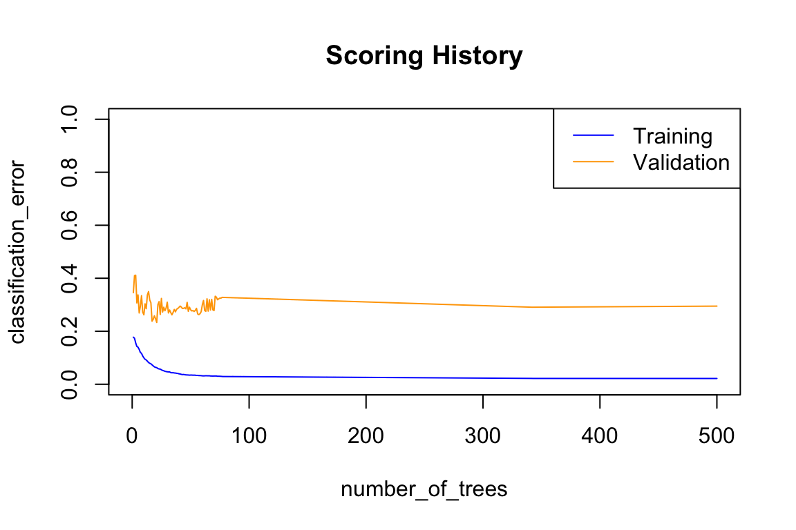
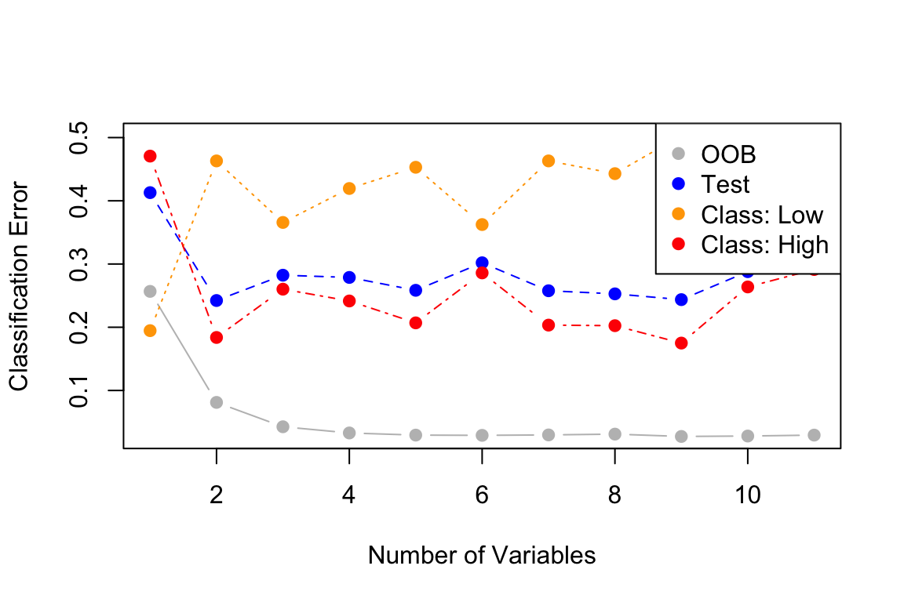
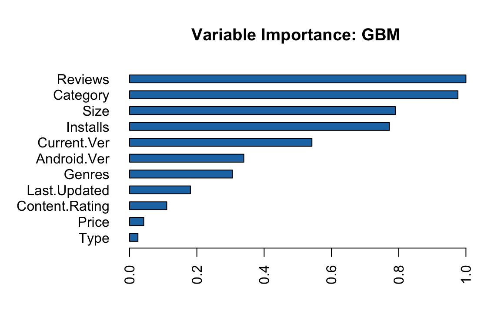

Predicting High Google Play App Ratings
================
[Hendrik Mischo](https://github.com/hendrik-mischo)
22 January 2019

Introduction
============

The aim of this project is to see if we can predict a high rating for Google Play Apps given the basic information provided on the Play Store. The supplemental dataset is available on [Kaggle](https://www.kaggle.com/lava18/google-play-store-apps).

I decided to make this a binary classification problem where an app rating can either be "high" if it is higher than 4.0 or "low" if it is below 4.0. I did this because I assume that users usually do not bother too much about whether an app has 4.1 or 4.3 stars. An app rated at least 4.0 is simply good app. Hence, the developer can be happy. If the rating is lower, there is room for improvement.

**Procedure:**
1. Data Exploration (briefly) and Cleaning
2. Model Building and Tuning
3. Evaluation

I will apply Logistic Regression, Random Forest and Boosting. This way we can compare not only tree-based models but also regression. To evalutate the performance of the models, I will look at the area under the curve (AUC), overall classification error and ensure the classification errors per class are more or less balanced.

Let's start with importing the relevant libraries and data.

``` r
library(tidyverse)  # For data wrangling
library(lubridate)  # To deal with dates
library(h2o)        # ML platform - Used for building models
library(data.table) # To be used with h2o (see documentation of "as.h2o")

# Import the data
data = read.csv("googleplaystore.csv", sep=",")
attach(data)
```

Data Exploration and Cleaning
=============================

First let's have a look at the structure of the data.

``` r
head(data)
```

                                                                App
    1                Photo Editor & Candy Camera & Grid & ScrapBook
    2                                           Coloring book moana
    3 U Launcher Lite \342\200\223 FREE Live Cool Themes, Hide Apps
    4                                         Sketch - Draw & Paint
    5                         Pixel Draw - Number Art Coloring Book
    6                                    Paper flowers instructions
            Category Rating Reviews Size    Installs Type Price Content.Rating
    1 ART_AND_DESIGN    4.1     159  19M     10,000+ Free     0       Everyone
    2 ART_AND_DESIGN    3.9     967  14M    500,000+ Free     0       Everyone
    3 ART_AND_DESIGN    4.7   87510 8.7M  5,000,000+ Free     0       Everyone
    4 ART_AND_DESIGN    4.5  215644  25M 50,000,000+ Free     0           Teen
    5 ART_AND_DESIGN    4.3     967 2.8M    100,000+ Free     0       Everyone
    6 ART_AND_DESIGN    4.4     167 5.6M     50,000+ Free     0       Everyone
                         Genres     Last.Updated        Current.Ver
    1              Art & Design  January 7, 2018              1.0.0
    2 Art & Design;Pretend Play January 15, 2018              2.0.0
    3              Art & Design   August 1, 2018              1.2.4
    4              Art & Design     June 8, 2018 Varies with device
    5   Art & Design;Creativity    June 20, 2018                1.1
    6              Art & Design   March 26, 2017                1.0
       Android.Ver
    1 4.0.3 and up
    2 4.0.3 and up
    3 4.0.3 and up
    4   4.2 and up
    5   4.4 and up
    6   2.3 and up

**Description of the variables:**
App - *Application name*
Category - *Category the app belongs to*
Rating - *Overall user rating of the app (as when scraped)*
Reviews - *Number of user reviews for the app (as when scraped)*
Size - *Size of the app (as when scraped)*
Installs - *Number of user downloads/installs for the app (as when scraped)*
Type - *Paid or Free*
Price - *Price of the app (as when scraped)*
Content Rating - *Age group the app is targeted at*
Genres - *An app can belong to multiple genres (apart from its main category).*
Last Updated - *Date when the app was last updated on Play Store (as when scraped)*
Current Ver - *Current version of the app available on Play Store (as when scraped)*
Android Ver - *Min. required Android version (as when scraped)*

Now check the variable formats and types.

``` r
glimpse(data)
```

    Observations: 10,841
    Variables: 13
    $ App            <fct> Photo Editor & Candy Camera & Grid & ScrapBook,...
    $ Category       <fct> ART_AND_DESIGN, ART_AND_DESIGN, ART_AND_DESIGN,...
    $ Rating         <dbl> 4.1, 3.9, 4.7, 4.5, 4.3, 4.4, 3.8, 4.1, 4.4, 4....
    $ Reviews        <fct> 159, 967, 87510, 215644, 967, 167, 178, 36815, ...
    $ Size           <fct> 19M, 14M, 8.7M, 25M, 2.8M, 5.6M, 19M, 29M, 33M,...
    $ Installs       <fct> 10,000+, 500,000+, 5,000,000+, 50,000,000+, 100...
    $ Type           <fct> Free, Free, Free, Free, Free, Free, Free, Free,...
    $ Price          <fct> 0, 0, 0, 0, 0, 0, 0, 0, 0, 0, 0, 0, 0, 0, 0, 0,...
    $ Content.Rating <fct> Everyone, Everyone, Everyone, Teen, Everyone, E...
    $ Genres         <fct> Art & Design, Art & Design;Pretend Play, Art & ...
    $ Last.Updated   <fct> January 7, 2018, January 15, 2018, August 1, 20...
    $ Current.Ver    <fct> 1.0.0, 2.0.0, 1.2.4, Varies with device, 1.1, 1...
    $ Android.Ver    <fct> 4.0.3 and up, 4.0.3 and up, 4.0.3 and up, 4.2 a...

Let's also have a look at the summary of the data to check if there are any abnormal values.

``` r
summary(data)
```

                                                    App       
     ROBLOX                                           :    9  
     CBS Sports App - Scores, News, Stats & Watch Live:    8  
     8 Ball Pool                                      :    7  
     Candy Crush Saga                                 :    7  
     Duolingo: Learn Languages Free                   :    7  
     ESPN                                             :    7  
     (Other)                                          :10796  
             Category        Rating          Reviews    
     FAMILY      :1972   Min.   : 1.000   0      : 596  
     GAME        :1144   1st Qu.: 4.000   1      : 272  
     TOOLS       : 843   Median : 4.300   2      : 214  
     MEDICAL     : 463   Mean   : 4.193   3      : 175  
     BUSINESS    : 460   3rd Qu.: 4.500   4      : 137  
     PRODUCTIVITY: 424   Max.   :19.000   5      : 108  
     (Other)     :5535   NA's   :1474     (Other):9339  
                     Size             Installs      Type           Price      
     Varies with device:1695   1,000,000+ :1579   0   :    1   0      :10040  
     11M               : 198   10,000,000+:1252   Free:10039   $0.99  :  148  
     12M               : 196   100,000+   :1169   NaN :    1   $2.99  :  129  
     14M               : 194   10,000+    :1054   Paid:  800   $1.99  :   73  
     13M               : 191   1,000+     : 907                $4.99  :   72  
     15M               : 184   5,000,000+ : 752                $3.99  :   63  
     (Other)           :8183   (Other)    :4128                (Other):  316  
             Content.Rating           Genres             Last.Updated 
                    :   1   Tools        : 842   August 3, 2018: 326  
     Adults only 18+:   3   Entertainment: 623   August 2, 2018: 304  
     Everyone       :8714   Education    : 549   July 31, 2018 : 294  
     Everyone 10+   : 414   Medical      : 463   August 1, 2018: 285  
     Mature 17+     : 499   Business     : 460   July 30, 2018 : 211  
     Teen           :1208   Productivity : 424   July 25, 2018 : 164  
     Unrated        :   2   (Other)      :7480   (Other)       :9257  
                 Current.Ver               Android.Ver  
     Varies with device:1459   4.1 and up        :2451  
     1.0               : 809   4.0.3 and up      :1501  
     1.1               : 264   4.0 and up        :1375  
     1.2               : 178   Varies with device:1362  
     2.0               : 151   4.4 and up        : 980  
     1.3               : 145   2.3 and up        : 652  
     (Other)           :7835   (Other)           :2520  

Looks like some cleaning is required.

I notice the following issues.
1) It appears that there are many factor variables that should be numeric.
2) The units of the sizes of the apps vary (KB and MB).
3) The installations have a "+" attached at the end.
4) `Price` values include the dollar sign.
5) It may be difficult for some algorithms to deal with dates.
6) `Current.Ver` and `Android.Ver` can only be treated as categories as they are.

I will clean the data and replace any abnormal values with NA. For the response variable `Rating` I will assign "High" to ratings of 4.0 or higher and "Low" to lower ratings.

``` r
# Drop unnecessary columns
data = data[,!names(data) == "App"]

data = data %>%
  mutate(
    # Convert "Varies with device" to NA in Size
    Size = ifelse(grepl("Varies with device", Size), NA, as.character(Size)),
    # Convert MB to KB
    Size = ifelse(grepl("M", Size), as.numeric(gsub("M", "", Size))*1000, as.character(Size)),
    # Drop the "k" in Size
    Size = as.numeric(gsub("k", "", Size)),
    # Drop the "+" in Installs
    Installs = gsub("\\+", "", as.character(Installs)),
    # Drop the "," and convert number of installs to numeric
    Installs = as.numeric(gsub(",", "", Installs)),
    # Convert number of reviews to numeric
    Reviews = as.numeric(Reviews),
    # Drop the "$" and convert Price to numeric
    Price = as.numeric(gsub("\\$", "", as.character(Price))),
    # Convert Last.Updated to categorical
    Last.Updated = mdy(Last.Updated),
    Last.Updated = ifelse(Last.Updated >= as.Date("2018-01-01"), "In 2018",
                   ifelse(Last.Updated < as.Date("2018-01-01") & 
                            Last.Updated >= as.Date("2017-01-01"), "In 2017",
                   ifelse(Last.Updated < as.Date("2017-01-01") & 
                            Last.Updated >= as.Date("2016-01-01"), "In 2016",
                   "Before 2016"))),
    Last.Updated = as.factor(Last.Updated),
    # Convert "Varies with device" to NA in Android.Ver
    Android.Ver = gsub("Varies with device", NA, Android.Ver),
    # Keep version number to 1 decimal only
    Android.Ver = as.numeric(substr(Android.Ver, start = 1, stop = 3)),
    # Convert "Varies with device" to NA in Current.Ver
    Current.Ver = gsub("Varies with device", NA, Current.Ver),
    # Keep version number to 1 decimal only
    Current.Ver = as.numeric(substr(Current.Ver, start = 1, stop = 3)),
    # Convert ratings larger than 5 to NA
    Rating = ifelse(Rating > 5, NA, as.numeric(Rating)),
    # Convert Rating to binary
    Rating = ifelse(Rating >= 4, "High", "Low"),
    Rating = as.factor(Rating)
  ) %>%
  # Drop the strange category "1.9"
  filter(!Category=="1.9")
```

Check if there are any NAs.

``` r
sapply(data, function(x) sum(is.na(x)))
```

          Category         Rating        Reviews           Size       Installs 
                 0           1474              0           1695              0 
              Type          Price Content.Rating         Genres   Last.Updated 
                 0              0              0              0              0 
       Current.Ver    Android.Ver 
              1620           1364 

Some variables contain missing values. For `Size` I will substitute the mean size and for `Current.Ver` and `Android.Ver` the median. However, this approach does not work for `Rating` because the average rating is 4.19, so all missing values would be assigned to the category "High", which could lead to bias. For this reason I decide to drop these observations. Given that the missing values in `Rating` make up about 13.6% of the observations we will still have enough training data.

``` r
data = data %>% 
  # Drop NAs in Rating
  drop_na(Rating) %>%
  mutate(
    # Replace NAs in Size with mean
    Size = ifelse(is.na(Size), mean(Size, na.rm = TRUE), Size),
    # Replace NAs in Andriod.Ver with median
    Android.Ver = ifelse(is.na(Android.Ver), median(Android.Ver, na.rm = TRUE), Android.Ver),
    # Replace NAs in Current.Ver with median
    Current.Ver = ifelse(is.na(Current.Ver), median(Current.Ver, na.rm = TRUE), Current.Ver)
    )
```

Glimpse the clean data.

``` r
head(data)
```

            Category Rating Reviews  Size Installs Type Price Content.Rating
    1 ART_AND_DESIGN   High    1183 19000    10000 Free     0       Everyone
    2 ART_AND_DESIGN    Low    5924 14000   500000 Free     0       Everyone
    3 ART_AND_DESIGN   High    5681  8700  5000000 Free     0       Everyone
    4 ART_AND_DESIGN   High    1947 25000 50000000 Free     0           Teen
    5 ART_AND_DESIGN   High    5924  2800   100000 Free     0       Everyone
    6 ART_AND_DESIGN   High    1310  5600    50000 Free     0       Everyone
                         Genres Last.Updated Current.Ver Android.Ver
    1              Art & Design      In 2018         1.0         4.0
    2 Art & Design;Pretend Play      In 2018         2.0         4.0
    3              Art & Design      In 2018         1.2         4.0
    4              Art & Design      In 2018         2.0         4.2
    5   Art & Design;Creativity      In 2018         1.1         4.4
    6              Art & Design      In 2017         1.0         2.3

Model Building and Tuning
=========================

With the preprocessed data we can start building models. For this part I decided to use H2O. H2O is an open-source, distributed, fast, and scalable predictive analytics platform. It supports the most widely used statistical learning algorithms. Here H2O is useful for two reasons. First, it is more potent than the algorithms of the standard packages as it allows for more parameters and it is faster. Second, it can handle categorical variables with many more categories. This way we can avoid one-hot encoding the `Genres`, which would significantly increase the number of independent variables as it contains 120 categories.

Now I will set up H2O and create the training, validation and test sets.

``` r
h2o.init(min_mem_size = "5g") # Start up H2O
h2o.removeAll()               # Clear - just in case the cluster was already running
h2o.no_progress()             # Do not show progress bar

# Covert data to H2O object
data = as.h2o(data)

# Create training, validation and test sets: 0.7, 0.15, 0.15
splits = h2o.splitFrame(data = data, ratios = c(0.7,0.15), seed = 2019)
train = splits[[1]]
valid = splits[[2]]
test = splits[[3]]

# Define features and response variable
Y = "Rating"
X = setdiff(colnames(data), Y)
```

Logistic Regression
-------------------

First, I establish baseline performance.

``` r
glm.base = h2o.glm(y = Y, x = X, 
                   training_frame = train, 
                   family = "binomial"
                   )
h2o.confusionMatrix(glm.base, newdata = valid)
```

    Confusion Matrix (vertical: actual; across: predicted)  for max f1 @ threshold = 0.228770632133301:
           High Low    Error       Rate
    High    713 413 0.366785  =413/1126
    Low     106 192 0.355705   =106/298
    Totals  819 605 0.364466  =519/1424

``` r
# Get the AUC
h2o.auc(h2o.performance(glm.base, newdata = valid))
```

    [1] 0.6849273

Now that we know the baseline performance, we can tune the model in more detail. The most important parameters are the alpha, which determines to what extent Ridge and Lasso are used, and the shrinkage parameter lambda.

``` r
hyper_parameters = list(alpha = seq(0,1,0.1))

glm.grid = h2o.grid(algorithm = "glm", 
                     y = Y, x = X,
                     hyper_params = hyper_parameters,
                     search_criteria = list(strategy = "Cartesian"),
                     training_frame = train, 
                     validation_frame = valid,
                     family = "binomial", 
                     lambda_search = TRUE, # automatically search for lambda
                     max_active_predictors = 11,
                     remove_collinear_columns=TRUE,
                     grid_id = "glm_grid"
                     )
glm.grid.sorted = h2o.getGrid("glm_grid", sort_by="auc", decreasing = TRUE)
```

Check how the tuned model performs on the validation set.

``` r
glm.tuned = h2o.getModel(glm.grid.sorted@model_ids[[1]])
h2o.confusionMatrix(glm.tuned, newdata = valid)
```

    Confusion Matrix (vertical: actual; across: predicted)  for max f1 @ threshold = 0.220462974926629:
           High Low    Error       Rate
    High    675 451 0.400533  =451/1126
    Low      98 200 0.328859    =98/298
    Totals  773 651 0.385534  =549/1424

``` r
# Get the AUC
h2o.auc(h2o.performance(glm.tuned, newdata = valid))
```

    [1] 0.68347

The performance did not improve compared to the base model. It appears that the machine found a better combination of hyperparameters.

I will now apply the test data to the base model to determine a final score for Logistic Regression.

``` r
h2o.confusionMatrix(glm.base, newdata = test)
```

    Confusion Matrix (vertical: actual; across: predicted)  for max f1 @ threshold = 0.228053822645043:
           High Low    Error       Rate
    High    685 406 0.372136  =406/1091
    Low     101 175 0.365942   =101/276
    Totals  786 581 0.370885  =507/1367

``` r
glm.err = round(h2o.confusionMatrix(glm.base, newdata = test)$Error[3], 3)
glm.auc = round(h2o.auc(h2o.performance(glm.base, newdata = test)), 3)
data.frame(AUC = glm.auc, ClassErr = glm.err)
```

        AUC ClassErr
    1 0.667    0.371

We use 5-fold cross-validation on the entire dataset to confirm that the parameters we found are reasonable.

``` r
glm.tuned.cv = do.call(h2o.glm,
                      ## update parameters in place
                      {
                        p = glm.tuned@parameters
                        p$model_id = NULL          # do not overwrite the original grid model
                        p$training_frame = data    # use the full dataset
                        p$validation_frame = NULL  # no validation frame
                        p$nfolds = 5               # cross-validation
                        p
                      })
glm.tuned.cv@model$cross_validation_metrics_summary["auc",]
```

    Cross-Validation Metrics Summary: 
              mean           sd cv_1_valid cv_2_valid cv_3_valid cv_4_valid
    auc 0.68049926 0.0066716154   0.678516  0.6697308  0.6857222 0.69587386
        cv_5_valid
    auc  0.6726536

We might have overfitted slightly since the AUC varies quite a bit depending on the train/test split.

Let's see how tree-based models compare.

Random Forest
-------------

Again I first establish baseline performance.

``` r
rf.base = h2o.randomForest(x = X, y = Y,
                      training_frame = train,
                      seed = 2019)
h2o.confusionMatrix(rf.base, newdata=valid)
```

    Confusion Matrix (vertical: actual; across: predicted)  for max f1 @ threshold = 0.324253055701653:
           High Low    Error       Rate
    High    913 213 0.189165  =213/1126
    Low     137 161 0.459732   =137/298
    Totals 1050 374 0.245787  =350/1424

``` r
# Get the AUC
h2o.auc(h2o.performance(rf.base, newdata = valid))
```

    [1] 0.7451214

While the overall classification error and the error rate for high ratings are classified relatively well, this model performs rather poorly at classifying low ratings. This may be because the data is somewhat unbalanced. Let's have a look at the fraction of observations in each category.

``` r
round(table(as.data.frame(train)$Rating) / nrow(as.data.frame(train)), 2)
```


    High  Low 
    0.78 0.22 

Now I will fit another Random Forest, but this time I add the `balance_classes` argument to balance the data using undersamping/oversampling.

``` r
rf.base = h2o.randomForest(x = X, y = Y, 
                      training_frame = train,
                      seed = 2019,
                      balance_classes = TRUE)
h2o.confusionMatrix(rf.base, newdata = valid)
```

    Confusion Matrix (vertical: actual; across: predicted)  for max f1 @ threshold = 0.149158395919337:
           High Low    Error       Rate
    High    835 291 0.258437  =291/1126
    Low     109 189 0.365772   =109/298
    Totals  944 480 0.280899  =400/1424

The overall error has increased, however the error for a low rating as has improved quite significantly.

Now we can tune the model to see if we can further improve the model. Let's find the optimal number of trees. To do this I will fit a new Random Forest with many trees and plot the errors.

``` r
rf = h2o.randomForest(x = X, y = Y, 
                      training_frame = train, 
                      validation_frame = valid,
                      seed = 2019,
                      balance_classes = TRUE,
                      ntrees = 500
                      )
plot(rf, timestep = "number_of_trees", metric="classification_error")
```



The optimal number of trees seems to be somewhere between 20 and 50. In order to determine the exact value, I add the `stopping_rounds` argument, which stops the fitting process when the moving average of length 10 of the error rate does no longer improve.

``` r
rf = h2o.randomForest(x = X, y = Y, 
                      training_frame = train, 
                      validation_frame = valid,
                      seed = 2019,
                      balance_classes = TRUE,
                      stopping_rounds = 10,
                      stopping_metric = "misclassification")
ntrees = rf@model$model_summary$number_of_trees
ntrees
```

    [1] 36

Next I will determine the optimal number of variables to be considered at each split.

``` r
oob.err = double(length(X))
test.err = double(length(X))
test.err.low = double(length(X))
test.err.high = double(length(X))

# Fit a new forest for each value of mtry and save the errors
for(mtry in 1:length(X)){
  rf = h2o.randomForest(x = X, y = Y, 
                      training_frame = train, 
                      validation_frame = valid,
                      seed = 2019,
                      balance_classes = TRUE,
                      ntrees = ntrees,
                      mtries = mtry)
  oob.err[mtry] = h2o.confusionMatrix(rf)$Error[3]
  test.err[mtry] = h2o.confusionMatrix(rf, newdata = valid)$Error[3]
  test.err.low[mtry] = h2o.confusionMatrix(rf, newdata = valid)$Error[2]
  test.err.high[mtry] = h2o.confusionMatrix(rf, newdata = valid)$Error[1]
}
# Plot the result
matplot(1:mtry, cbind(oob.err,test.err,test.err.low,test.err.high), pch=19, type="b", 
        xlab = "Number of Variables", ylab="Classification Error",
        col=c("grey", "blue", "orange", "red"))
legend("topright", legend=c("OOB", "Test", "Class: Low", "Class: High"), pch=19, 
       col=c("grey", "blue", "orange", "red"))
```



It appears that there is a trade-off between overall error rate and error for the "low" class. A good value seems to be 3 variables, which is also the default of the Random Forest function for our number of features.

``` r
rf.tuned = h2o.randomForest(x = X, y = Y, 
                            training_frame = train, 
                            validation_frame = valid,
                            seed = 2019,
                            balance_classes = TRUE,
                            ntrees = ntrees,
                            mtries = 3
                            )
h2o.confusionMatrix(rf.tuned, newdata = valid)
```

    Confusion Matrix (vertical: actual; across: predicted)  for max f1 @ threshold = 0.148197655348658:
           High Low    Error       Rate
    High    833 293 0.260213  =293/1126
    Low     109 189 0.365772   =109/298
    Totals  942 482 0.282303  =402/1424

``` r
# Get the AUC
h2o.auc(h2o.performance(rf.tuned, newdata = valid))
```

    [1] 0.7501401

Given that the default number of variables also turned out to be the optimal number, it is not surprising that the AUC and the errors did not improve a lot compared to the initial model. However, we managed to achieve the same performance with less trees, i.e. a simpler model.

Let's apply the test data to the base model to fix a final score for Random Forest.

``` r
h2o.confusionMatrix(rf.tuned, newdata = test)
```

    Confusion Matrix (vertical: actual; across: predicted)  for max f1 @ threshold = 0.132087483212575:
           High Low    Error       Rate
    High    767 324 0.296975  =324/1091
    Low      88 188 0.318841    =88/276
    Totals  855 512 0.301390  =412/1367

``` r
rf.err = round(h2o.confusionMatrix(rf.tuned, newdata = test)$Error[3], 3)
rf.auc = round(h2o.auc(h2o.performance(rf.tuned, newdata = test)), 3)
data.frame(AUC = rf.auc, ClassErr = rf.err)
```

        AUC ClassErr
    1 0.753    0.301

Let's use 5-fold cross-validation on the entire dataset to confirm that the parameters we found are reasonable.

``` r
rf.tuned.cv = do.call(h2o.randomForest,
                      ## update parameters in place
                      {
                        p = rf.tuned@parameters
                        p$model_id = NULL          # do not overwrite the original grid model
                        p$training_frame = data    # use the full dataset
                        p$validation_frame = NULL  # no validation frame
                        p$nfolds = 5               # cross-validation
                        p
                      })
rf.tuned.cv@model$cross_validation_metrics_summary["auc",]
```

    Cross-Validation Metrics Summary: 
             mean          sd cv_1_valid cv_2_valid cv_3_valid cv_4_valid
    auc 0.7549608 0.008698832  0.7611218 0.73556393 0.76958716  0.7462779
        cv_5_valid
    auc 0.76225305

It seems that the parameters are reasonable as the result does not vary significantly.

Boosting
--------

As before, we check the baseline performance first only providing the required parameters and leaving everything else default.

``` r
gbm.base = h2o.gbm(x = X, y = Y, 
                   training_frame = train,
                   seed = 2019
                   )
h2o.confusionMatrix(gbm.base, newdata = valid)
```

    Confusion Matrix (vertical: actual; across: predicted)  for max f1 @ threshold = 0.252598000932063:
           High Low    Error       Rate
    High    807 319 0.283304  =319/1126
    Low     108 190 0.362416   =108/298
    Totals  915 509 0.299860  =427/1424

``` r
# Get the AUC
h2o.auc(h2o.performance(gbm.base, newdata = valid))
```

    [1] 0.7304857

Let's check if balancing the classes has a noticeable effect.

``` r
gbm.base = h2o.gbm(x = X, y = Y, 
                   training_frame = train,
                   seed = 2019,
                   balance_classes = TRUE
                   )
h2o.confusionMatrix(gbm.base, newdata = valid)
```

    Confusion Matrix (vertical: actual; across: predicted)  for max f1 @ threshold = 0.246125340105317:
           High Low    Error       Rate
    High    810 316 0.280639  =316/1126
    Low     112 186 0.375839   =112/298
    Totals  922 502 0.300562  =428/1424

``` r
h2o.auc(h2o.performance(gbm.base, newdata = valid))
```

    [1] 0.7290537

Balancing the classes does not seem to effect the performance very much like it did with the Random Forest. This may be because the classes are only slightly unbalanced.

Next I will tune the model. Here we have more hyperparameters that we need to tune. For this purpose I will do a random grid search. The tuning approach I use for this model is based on [this article](https://www.h2o.ai/blog/h2o-gbm-tuning-tutorial-for-r/).

I start tuning the parameter `max_depth` because of its importance. It is not necessary to start with one, but we can save computing time by finding a range of a particularly important tuning parameter first.

``` r
hyper_params = list(max_depth = seq(1,30,1)) 

gbm.grid = h2o.grid(
  # Standard model parameters
  algorithm = "gbm",
  x = X,
  y = Y,
  training_frame = train,
  validation_frame = valid,
  seed = 2019,
  # Hyper parameters
  hyper_params = hyper_params,
  # Search criteria 
  search_criteria = list(strategy = "Cartesian"),
  # Identifier for the grid
  grid_id = "max_depth_grid",
  # Use a sufficient number of trees (limited by early stopping)
  ntrees = 1000,
  # Start with bigger learning rate. Smaller would be better, but learning_rate_annealing will shrink it
  learn_rate = 0.05,
  # Shrink learning_rate by 1% after every tree
  learn_rate_annealing = 0.99,
  # Sample 80% of rows per tree
  sample_rate = 0.8,
  # Sample 80% of columns per split
  col_sample_rate = 0.8,
  # Stop early if AUC does not improve by >= 0.01% for 5 consecutive scoring events
  stopping_rounds = 5,
  stopping_tolerance = 1e-4,
  stopping_metric = "AUC",
  # Score every 10 trees to make early stopping reproducible
  score_tree_interval = 10,
  # Balance the classes
  balance_classes = TRUE
)
```

Display the top 5 grid models by decreasing AUC.

``` r
gbm.grid.sorted = h2o.getGrid("max_depth_grid", sort_by="auc", decreasing = TRUE)
gbm.grid.sorted@summary_table[1:5,]
```

    Hyper-Parameter Search Summary: ordered by decreasing auc
      max_depth               model_ids                auc
    1         7  max_depth_grid_model_7 0.7373490528925817
    2        28 max_depth_grid_model_28 0.7370823250324842
    3        23 max_depth_grid_model_23 0.7368975526601261
    4        12 max_depth_grid_model_12 0.7364847950218747
    5         8  max_depth_grid_model_8 0.7363313147448354

Now find the `max_depth` range for the top 5 models.

``` r
topDepths = gbm.grid.sorted@summary_table$max_depth[1:5]
minDepth = min(as.numeric(topDepths))
maxDepth = max(as.numeric(topDepths))
```

The `max_depth` values of 7 to 28 seem to be best suited for this dataset.

Now that we know a good range for `max_depth`, we can further tune the other parameters to find the optimal combination.

First, I define the parameters and search criteria.

``` r
hyper_params = list(
  # Set max_depth range determined earlier
  max_depth = seq(minDepth, maxDepth, 1),
  # Search a large space of different parameters
  sample_rate = seq(0.2,1,0.01),
  col_sample_rate = seq(0.2,1,0.01),
  col_sample_rate_per_tree = seq(0.2,1,0.01),
  col_sample_rate_change_per_level = seq(0.9,1.1,0.01),
  min_rows = 2^seq(0,log2(nrow(train))-1,1),
  nbins = 2^seq(4,10,1),
  nbins_cats = 2^seq(4,12,1),
  min_split_improvement = c(0,1e-8,1e-6,1e-4),
  # Try all histogram types 
  histogram_type = c("UniformAdaptive","QuantilesGlobal","RoundRobin")
)

search_criteria = list(
  # Random grid search
  strategy = "RandomDiscrete",
  seed = 2019,
  # Limit processing time
  max_runtime_secs = 3600,
  max_models = 100,
  # Early stopping once the leaderboard of the top 5 models is converged to 0.1% relative difference
  stopping_rounds = 5,
  stopping_metric = "AUC",
  stopping_tolerance = 1e-3
)
```

With the updated and extended hyperparameters and search criteria we create a new grid.

``` r
gbm.grid = h2o.grid(
  # Standard model parameters
  algorithm = "gbm",
  x = X,
  y = Y,
  training_frame = train,
  validation_frame = valid,
  seed = 2019,
  # Hyper parameters
  hyper_params = hyper_params,
  # Search criteria 
  search_criteria = search_criteria,
  # Identifier for the grid
  grid_id = "gbm_grid",
  # Use a sufficient number of trees (limited by early stopping)
  ntrees = 1000,
  # Start with bigger learning rate. Smaller would be better, but learning_rate_annealing will shrink it
  learn_rate = 0.05,
  # Shrink learning_rate by 1% after every tree
  learn_rate_annealing = 0.99,
  # Stop early if AUC does not improve by >= 0.01% for 5 consecutive scoring events
  stopping_rounds = 5,
  stopping_tolerance = 1e-4,
  stopping_metric = "AUC",
  # Score every 10 trees to make early stopping reproducible
  score_tree_interval = 10,
  # Balance the classes
  balance_classes = TRUE
)
```

Again display the top 5 models to see investigate their AUC and parameters.

``` r
gbm.gird.sorted = h2o.getGrid("gbm_grid", sort_by="auc", decreasing = TRUE)
gbm.gird.sorted@summary_table[1:5,]
```

    Hyper-Parameter Search Summary: ordered by decreasing auc
      col_sample_rate col_sample_rate_change_per_level
    1             0.7                             1.06
    2            0.41                             1.02
    3            0.76                             1.06
    4            0.46                             0.99
    5            0.43                             0.97
      col_sample_rate_per_tree  histogram_type max_depth min_rows
    1                     0.95      RoundRobin        18      4.0
    2                     0.47      RoundRobin        12     16.0
    3                     0.98 QuantilesGlobal        15      8.0
    4                     0.67 QuantilesGlobal        18      8.0
    5                     0.75 QuantilesGlobal        19      2.0
      min_split_improvement nbins nbins_cats sample_rate         model_ids
    1                1.0E-6   128         32        0.55 gbm_grid_model_81
    2                1.0E-4    32         32        0.74 gbm_grid_model_70
    3                1.0E-6    64       1024        0.76 gbm_grid_model_54
    4                1.0E-8    64         32        0.74 gbm_grid_model_44
    5                1.0E-8    16         64        0.75 gbm_grid_model_32
                     auc
    1 0.7558844040196931
    2 0.7553509482994981
    3 0.7550156758496549
    4 0.7540903238880875
    5 0.7537625019371297

Now let's evaluate the model performance on the test set to give it a final score.

``` r
gbm.tuned = h2o.getModel(gbm.gird.sorted@model_ids[[1]])
h2o.confusionMatrix(gbm.tuned, newdata = test)
```

    Confusion Matrix (vertical: actual; across: predicted)  for max f1 @ threshold = 0.0823590671869883:
           High Low    Error       Rate
    High    776 315 0.288726  =315/1091
    Low      87 189 0.315217    =87/276
    Totals  863 504 0.294075  =402/1367

``` r
gbm.err = round(h2o.confusionMatrix(gbm.tuned, newdata = test)$Error[3], 3)
gbm.auc = round(h2o.auc(h2o.performance(gbm.tuned, newdata = test)), 3)
data.frame(AUC = gbm.auc, ClassErr = gbm.err)
```

        AUC ClassErr
    1 0.763    0.294

I will use cross-validation on the entire dataset to confirm that the parameters we found are reasonable.

``` r
gbm.tuned.cv = do.call(h2o.gbm,
                       ## update parameters in place
                       {
                         p = gbm.tuned@parameters
                         p$model_id = NULL          # do not overwrite the original grid model
                         p$training_frame = data    # use the full dataset
                         p$validation_frame = NULL  # no validation frame
                         p$nfolds = 5               # cross-validation
                         p
                        })
gbm.tuned.cv@model$cross_validation_metrics_summary["auc",]
```

    Cross-Validation Metrics Summary: 
             mean          sd cv_1_valid cv_2_valid cv_3_valid cv_4_valid
    auc 0.7639266 0.005680883  0.7618913  0.7495378 0.76970327  0.7659724
        cv_5_valid
    auc  0.7725283

We can see that the mean of the cross-validated AUC and the test AUC are very similar and that the standard deviation is rather small. This is a good sign as it indicates that we did not over or underfit a lot.

Evaluation
==========

Having built and tuned the models, we now want to evaluate and compare their results to decide which is the best.

Let's compare the final performance of the models on the test set side by side.

``` r
data.frame(GLM = c(glm.auc, glm.err),
           RF = c(rf.auc, rf.err),
           GBM = c(gbm.auc, gbm.err),
           row.names = c("AUC", "Class. Err.")
           )
```

                  GLM    RF   GBM
    AUC         0.667 0.753 0.763
    Class. Err. 0.371 0.301 0.294

We can clearly see that Logistic Regression performed worst. After tuning the parameters Boosting turned out to perform slightly better than the Random Forest in terms of AUC and Classification Error. Hence we would choose Boosting as the prefered model. Whether 29.4% classification error is acceptable or not depends on the context. As we have seen earlier, 24.5% could also be achieved with a default Random Forest, but at the cost of a higher error for the "low" class.

Finally, let's check how the different variables influenced this result.

``` r
h2o.varimp_plot(gbm.tuned, num_of_features = 11)
```



This ranking makes intuitive sense: `Reviews` and `Installs` are an indication of how much an app is used. If an app has a large user base we would expect it to be a good app. `Category` is the second most important variable. It seems that in some categories the users are happier with the apps than in others. It also makes sense that `Size` is highly related to the rating. The larger the app, the more features it probably has, the more useful or entertaining it probably is. I am surprised, however, that `Price` has such a small impact because one might expect that an app is generally better the more it costs. A reason for this may be that most apps are free in this data set.
