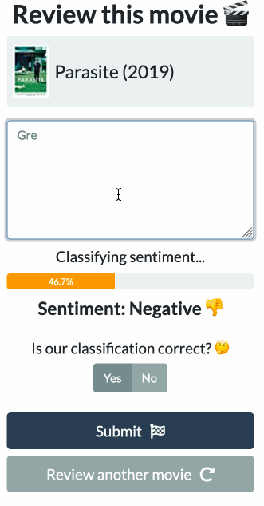
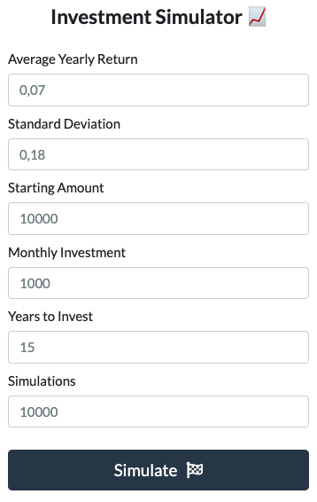

This repository is a compilation of some of the projects I worked on. Usually the objective of these projects is to derive interesting insights from data and build useful models using data science and machine learning techniques. Click headlines to see the analysis and code.

### [Crypto Tracker Website (work in progress)](https://github.com/hencho108/crypto-tracker-website)

A website that allows users to track the performance of their crypto currency portfolio in real time simply by importing their trades.

Key Features:
- Main page
- Sign up and login pages with SQLlite database interaction
- Ability to import CSV containing trades for each user
- Coinmarketcap API integration to get real time and historic prices
- Automatic calculation of current portfolio performance

## [Machine Learning Deployment: Movie Review Sentiment Classifier](https://github.com/hencho108/movie-review-sentiment)

In this project my colleage Kelly Raas and I trained and deployed a machine learning model into an interactive web app. The web app allows a user to review random movies. As the user is typing, the app classifies the sentiment of the review in either positive or negative along with a probability in real-time. If the proposed sentiment classification is not correct, the user can submit feedback so that the model can learn. You can think of this as an app that suggests an appropriate score for a review with a sentiment analysis model that learns with more reviews.

View a live demo of the app [here](https://movie-review-ai.herokuapp.com/).

We built the application following these steps:
- Collecting training data from a [dataset](https://ai.stanford.edu/~amaas/data/sentiment/) of 50,000 highly polar movie reviews
- Training a SVM classifier using Sklearn (approx. 90% accuracy, precision and recall)
- Scraping movie titles from IMDB using Beautiful Soup
- Building an interactive web app using Dash (Flask based)
- Deploying the app to Heroku

Potential next steps for further improvement:
- Training a more sophisticated model (deep learning)
- Trying different pre-processing techniques, e.g. n-grams and lemmatization since the SVM model performs poorly in some cases such as differatiating between "good" and "not good"
- Setting up a SQL database to store user feedback

## [Wolrd Portfolio](https://github.com/hencho108/world-portfolio)

[View live demo](https://world-portfolio.herokuapp.com/)

A simple web app that allows users to simulate the return of their investment portfolio by providing the excepted annual return and standard deviation. 

## [Black Friday: EDA, Spending Prediction and Recommendation System](https://github.com/hencho108/black-friday-analysis)
- Data: 550k+ Observations about Black Friday shoppers
- Derived valuable insights about customers and products
- Predicted customer spending using Linear Model and Random Forest
- Built a [Recommendation System](https://en.wikipedia.org/wiki/Recommender_system) that recommends new products to customers, which they are likely to purchase

## [Predicting High Google Play App Ratings](https://github.com/hencho108/google-app-ratings)
- Data: Details of 10k+ apps scraped from Google Play Store
- Established baseline performance of Logistic Regression model, Random Forest and Boosting
- Tuned all models to find optimal hyperparameters
- Implemented [H2O.ai](https://www.h2o.ai/)'s machine learning platform for faster computing
- Evaluated model performance
- Determined the most important variables that influence high app rating

## [Outlier Detection](https://github.com/hencho108/outlier-detection)
The objective of this project was to detect anomalies, i.e. patterns that do not conform to “normal” behavior, in a dataset of breast cancer biopsies. Three common outlier detection methods were compared: Mahalanobis Distance, DBSCAN and Expectation Maximization. The analysis highlighted the strengths and weaknesses of each algorithm and provided insights about situations when one model would be preferable to another.

## [Finding the Optimal Stock Portfolio (Spanish)](https://github.com/hencho108/optimal-stock-portfolio)
The objective of this project was to determine an optimal stock portfolio that maximizes the expected return given that I had 10,000 EUR to invest. I worked with real stock market data and found the optimal stocks and quantities by solving a fuzzy mathematical programming problem.

## [Web-Scraping My University's Job Board](https://github.com/hencho108/web-scraping-doip)
My university has a job board where new internship and job opportunities are posted regularily. To better analyze the job postings I created a web-scraping tool that can export all postings as CSV.

## [Monty Hall Problem Simulation](https://github.com/hencho108/monty-hall-simulation)
Recently, I watched the movie "21". In one of the scenes they talk about a famous statistical problem, the [Monty Hall problem](https://en.wikipedia.org/wiki/Monty_Hall_problem). I couldn't believe that it is true, so I ran a simulation to find out myself.

