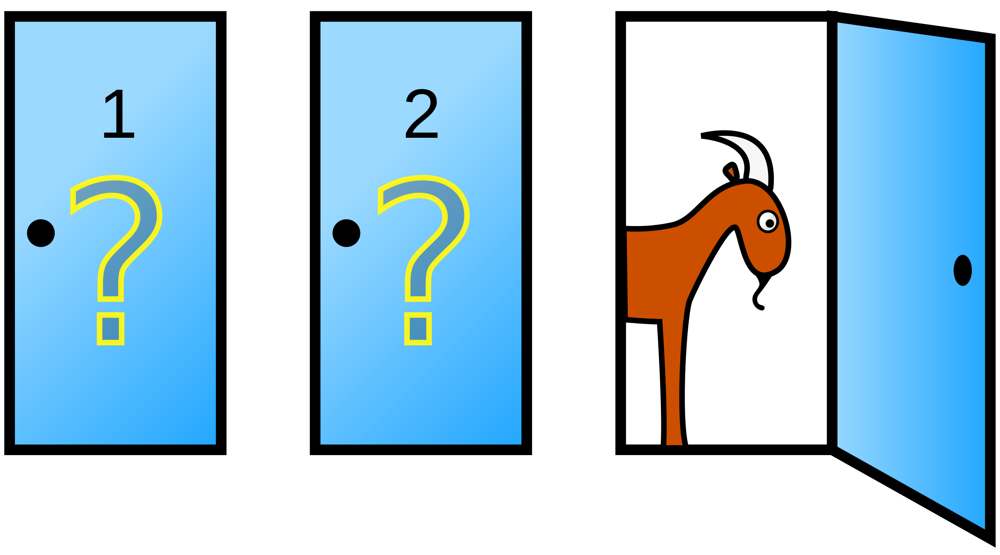

### [hendrik-mischo.github.io](https://hendrik-mischo.github.io)
# Data Science Portfolio by [Hendrik Mischo](https://github.com/hendrik-mischo)
This repository is a compilation of some of the projects I worked on. The aim of the projects is to derive interesting insights from data and build useful models using data science and machine learning techniques. The projects are written either in R or Python. Click headlines to see analysis and code.

## [Black Friday: EDA, Spending Prediction and Recommendation System](https://hendrik-mischo.github.io/Projects/Black_Friday/Black_Friday.html)
*Collaboration with classmate [Kelly Raas](https://github.com/kellyraas)*  
Data: 550k+ Observations about Black Friday shoppers
- Derived valuable insights about customers and products
- Predicted customer spending using Linear Model and Random Forest
- Built a [Recommendation System](https://en.wikipedia.org/wiki/Recommender_system) that recommends new products to customers, which they are likely to purchase

## [Predicting High Google Play App Ratings](https://hendrik-mischo.github.io/Projects/Google_Apps/Google_Apps.html)
Data: Details of 10k+ apps scraped from Google Play Store
- Established baseline performance of Logistic Regression model, Random Forest and Boosting
- Tuned all models to find optimal hyperparameters
- Implemented [H2O.ai](https://www.h2o.ai/)'s machine learning platform for faster computing
- Evaluated model performance
- Determined the most important variables that influence high app rating

## [Outlier Detection](https://hendrik-mischo.github.io/Projects/Outlier_Detection/Outlier_Detection.html)
The objective of this project was to detect anomalies, i.e. patterns that do not conform to “normal” behavior, in a dataset of breast cancer biopsies. Three common outlier detection methods were compared: Mahalanobis Distance, DBSCAN and Expectation Maximization. The analysis highlighted the strengths and weaknesses of each algorithm and provided insights about situations when one model would be preferable to another.

## [Finding the Optimal Stock Portfolio (Spanish)](https://hendrik-mischo.github.io/Projects/Optimal_Stock_Portfolio/Optimal_Stock_Portfolio.html)
The objective of this project was to determine an optimal stock portfolio that maximizes the expected return given that I had 10,000 EUR to invest. I worked with real stock market data and found the optimal stock and quantities by solving a fuzzy mathematical programming problem.

## [Web-Scraping My University's Job Board](https://hendrik-mischo.github.io/Projects/WebScraping_DOIP/WebScraping_DOIP.html)
My university has a job board where new internship and job opportunities are posted regularily. To better analyze the job postings I created a web-scraping tool that can export all postings as CSV.

## [Monty Hall Problem Simulation](https://hendrik-mischo.github.io/Projects/Monty_Hall_Simulation/Monty_Hall_Simulation.html)
Recently, I watched the movie "21". In one of the scenes they talk about a famous statistical problem, the [Monty Hall problem](https://en.wikipedia.org/wiki/Monty_Hall_problem). I couldn't believe that it is true, so I ran a simulation to find out myself.

